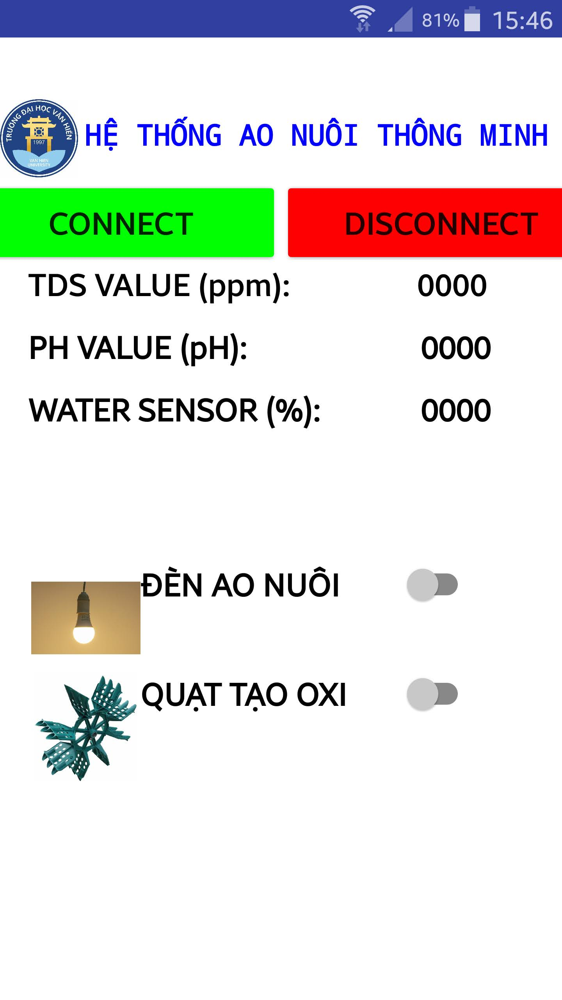
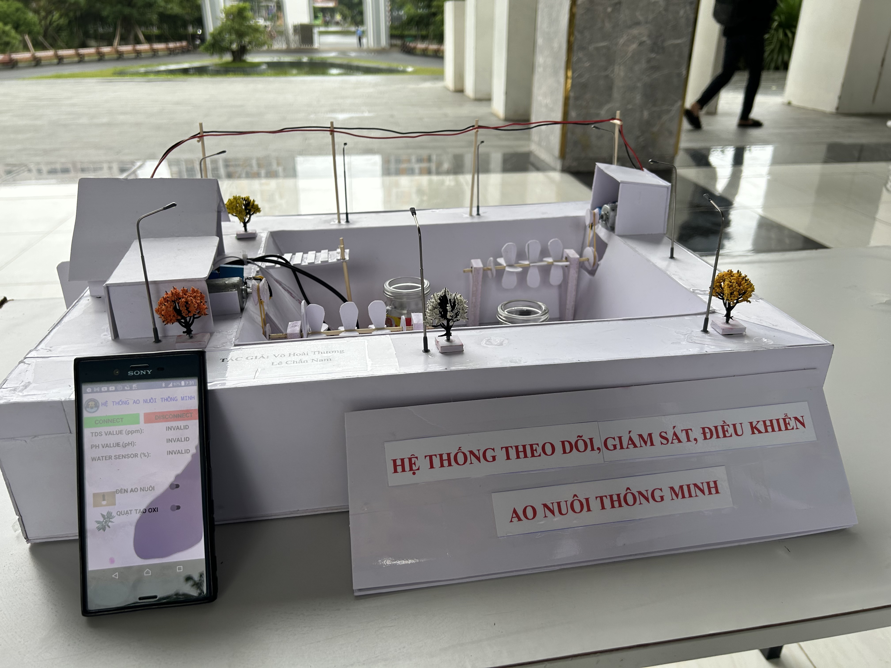

# Ao Nuôi Tôm - Phiên Bản Học Thuật

## Giới thiệu
Dự án **Ao Nuôi Tôm - Phiên Bản Học Thuật** được thực hiện như một tiền đề cho đồ án chuyên ngành. Mục tiêu chính là làm quen với các cảm biến và ngoại vi cần thiết cho hệ thống ao nuôi tôm. Dự án được thiết kế nhanh chóng trong **2 ngày** để tham gia **Hội thi Học thuật khoa Kỹ Thuật Công Nghệ VHU 2024** và đã đạt giải **3**.

Hệ thống giúp giám sát và điều khiển thiết bị trong ao nuôi thông qua ứng dụng di động, cung cấp tính năng cơ bản nhưng hiệu quả và ổn định.

---

## Công nghệ và phần cứng sử dụng
- **Arduino Nano**: Vi xử lý chính để điều khiển toàn hệ thống.
- **Bluetooth HC-06**: Kết nối không dây với ứng dụng di động.
- **Gravity TDS Sensor**: Đo chỉ số chất hòa tan trong nước.
- **PH-4502C**: Đo độ pH trong nước.
- **Relay (x2)**: Điều khiển 2 động cơ quạt oxi và đèn ao nuôi.
- **Cảm biến mức nước**: Theo dõi mức nước, hiển thị trên ứng dụng.
- **Nguồn điện hạ áp 5V**: Đảm bảo an toàn và ổn định cho hệ thống.

---

## Tính năng
### Tính năng chính:
1. **Giám sát thông số từ xa**:
   - Đo chỉ số TDS (mg/L), độ pH, và mức nước trong ao.
   - Hiển thị thông số lên ứng dụng di động.
2. **Điều khiển thiết bị**:
   - Kích hoạt hoặc tắt quạt oxi và đèn ao nuôi thông qua ứng dụng.
3. **Thông báo mức nước**:
   - Cảm biến mức nước chỉ báo trạng thái trên ứng dụng (chưa có cơ chế kiểm soát tự động).
4. **Hiển thị trực quan**:
   - Thông số TDS và pH được hiển thị trên màn hình LCD I2C.

---

## Hướng dẫn đấu dây
### Kết nối các thiết bị:
#### Cảm biến TDS:
- **VCC (TDS Sensor)** → 5V trên Arduino.
- **GND** → GND trên Arduino.
- **Analog Out** → Chân A1 trên Arduino.

#### Cảm biến pH:
- **VCC (PH-4502C)** → 5V trên Arduino.
- **GND** → GND trên Arduino.
- **Analog Out** → Chân A0 trên Arduino.

#### Cảm biến mức nước:
- **VCC** → Chân số 7 trên Arduino.
- **GND** → GND trên Arduino.
- **Analog Out** → Chân A2 trên Arduino.

#### Bluetooth HC-06:
- **TX (HC-06)** → Chân D3 trên Arduino.
- **RX (HC-06)** → Chân D2 trên Arduino.

#### Relay (quạt oxi và đèn):
- **IN1 (Relay)** → Chân số 4 trên Arduino (Quạt oxi 1).
- **IN2 (Relay)** → Chân số 5 trên Arduino (Đèn ao nuôi).

#### Màn hình LCD I2C:
- **VCC** → 5V trên Arduino.
- **GND** → GND trên Arduino.
- **SDA** → Chân A4 trên Arduino.
- **SCL** → Chân A5 trên Arduino.

---

## Hình ảnh
### 1. Ứng dụng di động:

### 2. Mô hình Ao Nuôi Tôm:

